This list is an Android tool/utility recommendation inspired by [nikitavoloboev](https://github.com/nikitavoloboev/my-mac-os/) and [Awesome-Windows](https://github.com/Awesome-Windows/Awesome).
I tried to list apps here that have an easily understandable value and might not be widely known (except for programs that have recommendable extensions/customization that warrants their place here)

The goal is to spark productivity ideas and inspiration and also to shout out to all the great devs who make life better through their creations.

# General

### [Anysoft keyboard](https://play.google.com/store/apps/details?id=com.menny.android.anysoftkeyboard&hl=en)

<table>
  <tr>
    <td>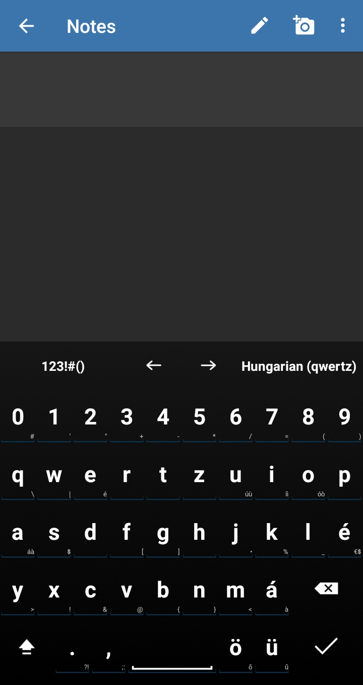</td>
    <td width="450" valign="top">
    Smartphone touch keyboards are really subjective matter. Instead of flashy features and gestures I like keyboards that have good customizeability to allow the user to make the design choices. 
       
  Anysoft's keyboard does not only have a huge amount of themes, but has also great language plugins (type accents directly!), gestures, and toggleable add-on keyboard options.
    </td>
  </tr>
</table>

### [ExDialer](https://play.google.com/store/apps/details?id=com.modoohut.dialer)

<table>
  <tr>
    <td>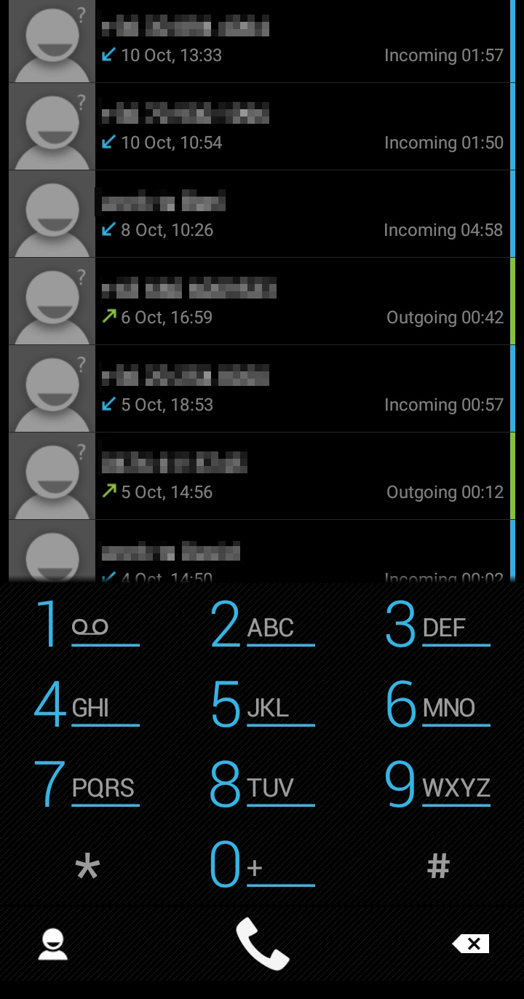</td>
    <td width="450" valign="top">
      The dialer is amongst the most basic apps on a phone. Yet since it manages potentially hundreds of contacts, it needs to be resourceful, fast and compact - that's what most default dialers can't do. Exdialer is amongst the best options - lots of themes, great t9 search, and plenty of display settings.
    </td>
  </tr>
</table>

### [App Usage](https://play.google.com/store/apps/details?id=com.a0soft.gphone.uninstaller)

<table>
  <tr>
    <td>
      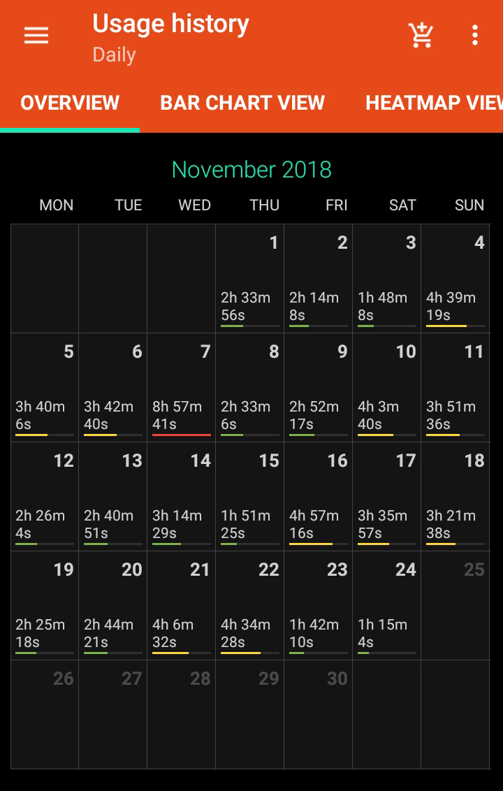
      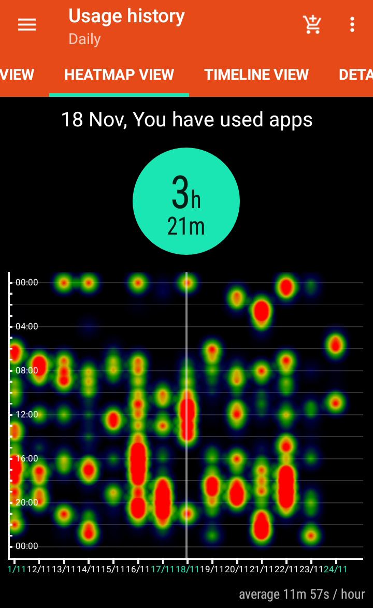
    </td>
    <td width="450" valign="top">
     While Android has built in usage monitoring for a while, App Usage is way more granular and has more stats and display options. Even better, the stats are exportable in various formats.
    </td>
  </tr>
</table>

### [CamScanner](https://play.google.com/store/apps/details?id=com.intsig.camscanner)

<table>
  <tr>
    <td>
      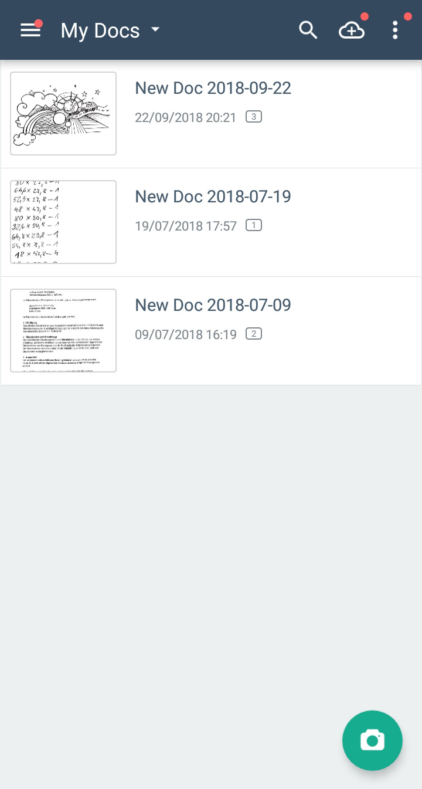
      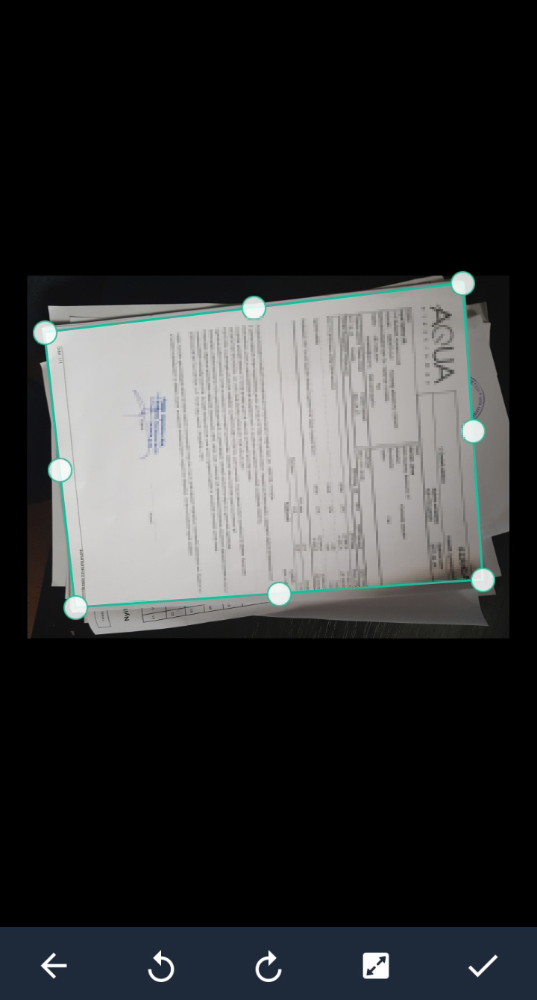
    </td>
    <td width="450" valign="top">
      There is often a need to photograph text/documents/contracts. As these photos can look a bit off, "scanner" apps became popular to auto-crop and fine-tune these photos to look like scanned documents. 
      
  Some phones even have this by default in the camera settings - I recommend CamScanner, a really versatile and easy to use app. It will auto-stretch and enhance any text photograph to look as sharp as possible.
    </td>
  </tr>
</table>

### [AutoNotification](https://play.google.com/store/apps/details?id=com.joaomgcd.autonotification)

In a lot of cases, some aps or Android System will shovel a permanent notification icon in your status bar, or drop toasts: battery is low, VPN is enabled, etc. You can all hide/block these with AutoNotification based on app or keyword filtering. Block any unwanted notifications/toasts in the future.

### [Nova Launcher](https://play.google.com/store/apps/details?id=com.teslacoilsw.launcher&hl=en)

<table>
  <tr>
    <td>
      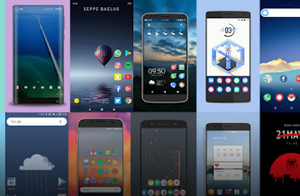
      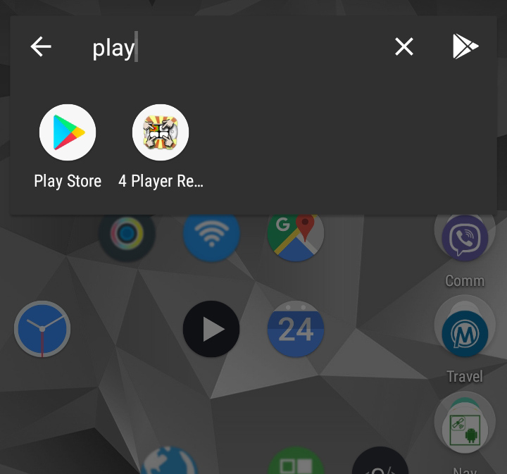
    </td>
    <td width="450" valign="top">
      Anyone who ever searched for an alternative launcher, surely knows Nova already, still, it feels underappreciated. It has tons of options to display and sort launcher icons, customize home screen gestures (eg swipe down anywhere for the notification panel) has a fantastic type-to-search app launcher (similar to desktop OSes) and great performance.
    </td>
  </tr>
</table>

### [DiskDigger](https://play.google.com/store/apps/details?id=com.defianttech.diskdigger)

<table>
  <tr>
    <td>
      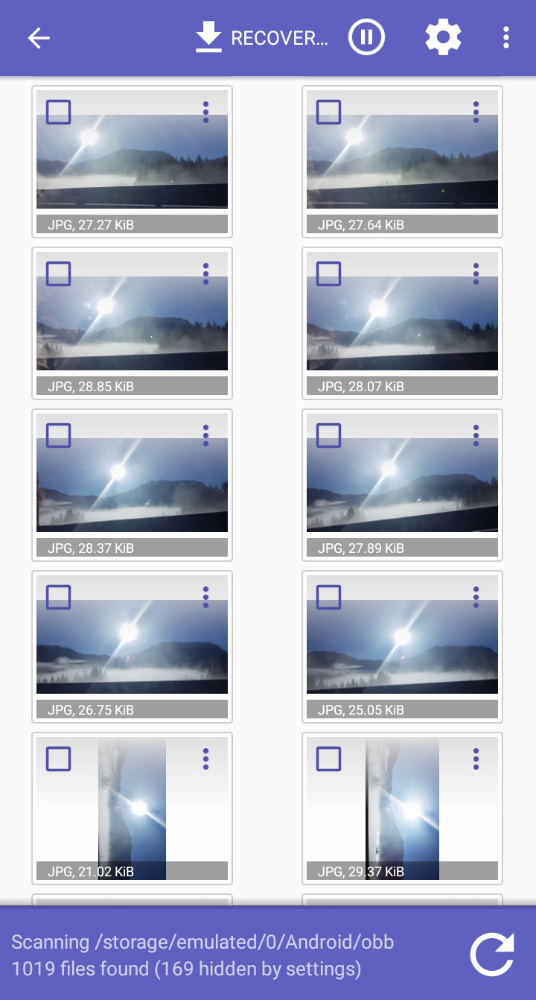
    </td>
    <td width="450" valign="top">
      Restore photos or other documents that you accidentally deleted from your device.
    </td>
  </tr>
</table>

### [Hostname changer](https://play.google.com/store/apps/details?id=com.bigos.hostnamechanger)

<table>
  <tr>
    <td>
      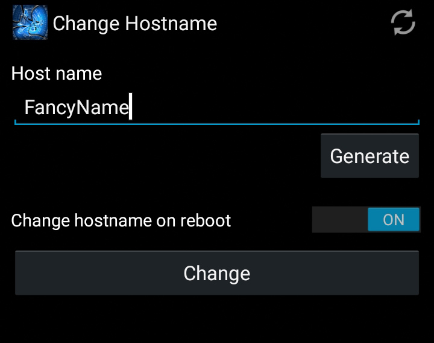
    </td>
    <td width="450" valign="top">
      **Requires root** Change the hostname of your Android device. Handy if you want it to be easily recognizeable in your home network.
    </td>
  </tr>
</table>

### [1.1.1.1](https://play.google.com/store/apps/details?id=com.cloudflare.onedotonedotonedotone)

<table>
  <tr>
    <td>
      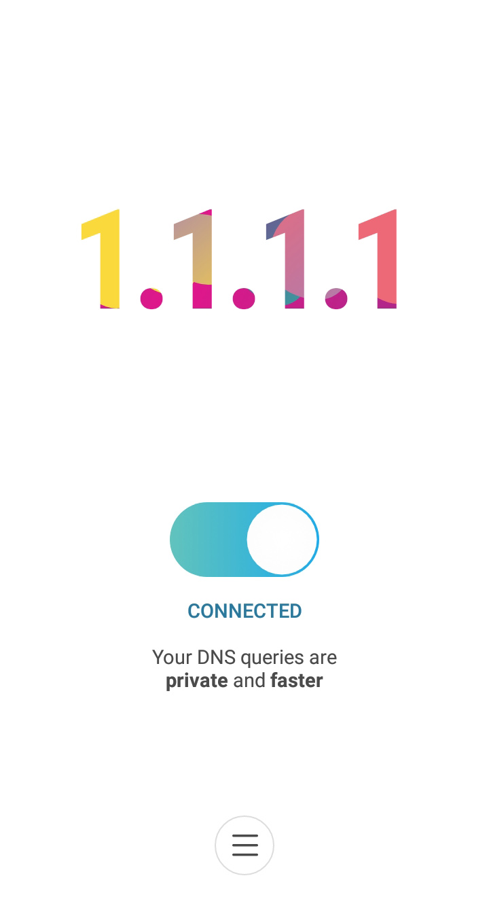
    </td>
    <td width="450" valign="top">
      Generally I'd recommend to use a VPN for network privacy, every little step helps to hide our activity from snooping eyes of our ISP. Cloudflare's app sets the DNS address of your device to its reliable and fast 1.1.1.1 address with a single switch.
    </td>
  </tr>
</table>

### [Autostart](https://play.google.com/store/apps/details?id=com.autostart&hl=en)

Some apps don't have the option to start on boot, even if they are needed to do so. This app launches them.

### [FeedMe](https://play.google.com/store/apps/details?id=com.seazon.feedme)

<table>
  <tr>
    <td>
      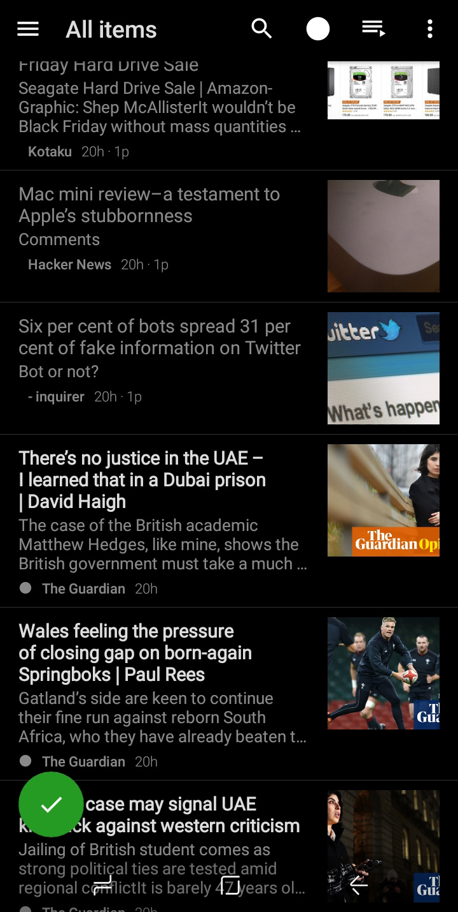
    </td>
    <td width="450" valign="top">
      Getting news and articles from myriads of websites/designs is not fun - it's much easier to skim through titles from a standarized list that lists all the news sources you are interested in - that's why there is RSS, and with that Feedly aggregation is the best.

While it has some quirks, Feedly is still the best news reader I found. It has all the options it needs - syns already read items, theming, news item gestures, font/image options, along with myriads of integrations like Pocket or Evernote.

</td>

  </tr>
</table>

### [My GPS Coordinates](https://play.google.com/store/apps/details?id=com.freemium.android.apps.gps.coordinates)

<table>
  <tr>
    <td>
      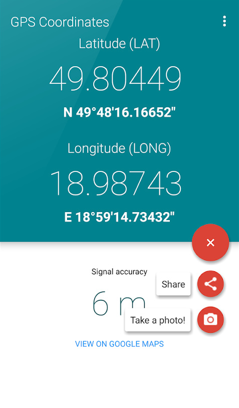
    </td>
    <td width="450" valign="top">
      While GPS is being ubiquitous, its simplest form, gps coordinates are always hidden (even if it is supported by eg. Google Maps). To help rescue personnel or just share your location in the fastest/most compatible form, I always have this handy.
    </td>
  </tr>
</table>

### [NewPipe](https://f-droid.org/en/packages/org.schabi.newpipe/)

<table>
  <tr>
    <td>
      
    </td>
    <td width="450" valign="top">
      YouTube can't play videos when its not active. With NewPipe, it can. It's a reimplementation of YouTube functionality using nothing but webscraping/undocumented api. 
      
  Besides this handy function, it has a number of options not available in the official client, even if it's a wee bit slower. Note that this app is obviously not supported by Google, therefore you need to download it from outside the Play Store.
    </td>
  </tr>
</table>

### [Power Toggles](https://play.google.com/store/apps/details?id=com.painless.pc)

<table>
  <tr>
    <td>
      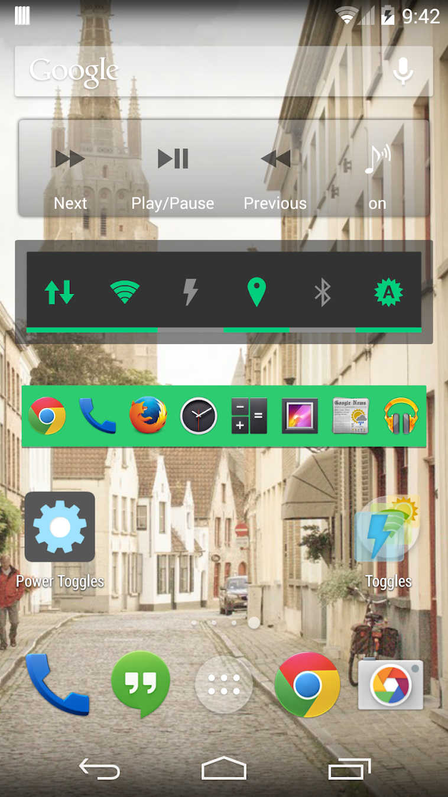
    </td>
    <td width="450" valign="top">
      While on most phones the notification menu shortcuts are pretty customizeable, you still have to swipe down the screen to access them. Nothing beats home screen widgets for speed, and customizeable home screens are a major UX win for Android - so, instead of the myriads of mostly bad widget app options, why wouldn't you build widgets that you like?

Power toggles allows you to create any number of custom widgets with buttons or stat texts, controlling Android or launching apps or urls - customizeable with color, icon themes, backgrounds.

</td>

  </tr>
</table>

### [Sms Backup+](https://play.google.com/store/apps/details?id=com.zegoggles.smssync)

While things like contacts/photos/files can be easily synced through Google/cloud accounts, SMS-es (yes, sometimes people still use those) are almost always left in the dust when a phone gets reinstalled/replaced/lost. This app provides an ingenious solution: it automatically sends sms-es as 'read' emails under a specific tag to your gmail (or other mail address). This way all your messages remain saved, and are easily searchable. Even call log and mms-es are supported.

### [Substratum](https://play.google.com/store/apps/details?id=projekt.substratum)

<table>
  <tr>
    <td>
      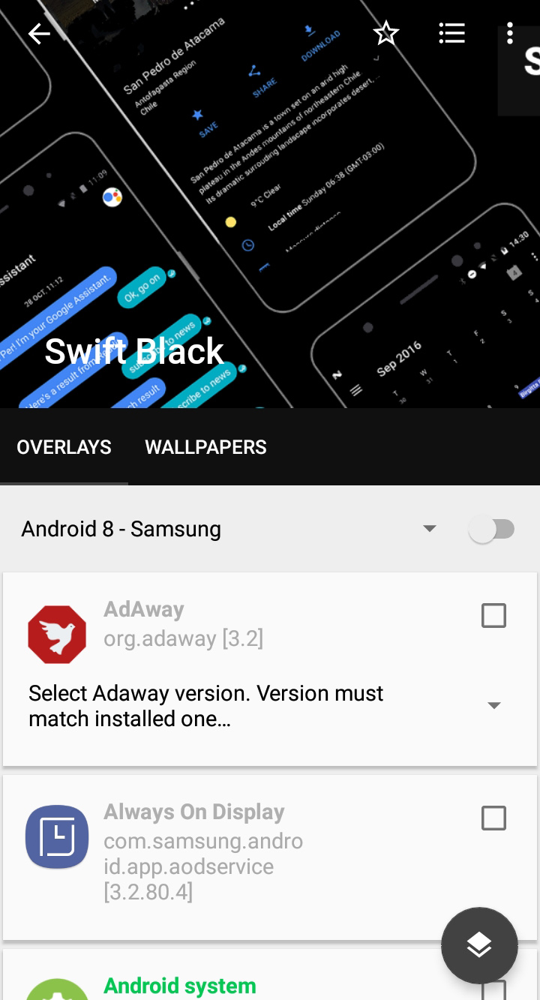
       
    </td>
    <td width="450" valign="top">
     **Requires root** Wouldn't you like all your apps to have a dark mode, or themed after a certain color? Substratum is a clever app that requires some hassle and change in your habits, but works for all major apps. 
     
  Basically it applies community-made patches for well-known apps (like Google Maps, Instagram, and even the window subsystem like the system dropdown menu) that you have to apply one by one manually through a list. It provides a similar modification/overlay of an app like DarkReader for browsers. The catch is that you can't auto-update those apps anymore, or your system (since a patch might not be ready at release time, only after a few days). 
  
  This might be a deal-breaker for more security-conscious people, but for anyone else wishing for nice black screens, this is it. For Samsung phones, I recommend the Swift Black theme (separate download).
    </td>
  </tr>
</table>

### [Solid Explorer](https://play.google.com/store/apps/details?id=pl.solidexplorer2)

<table>
  <tr>
    <td>
      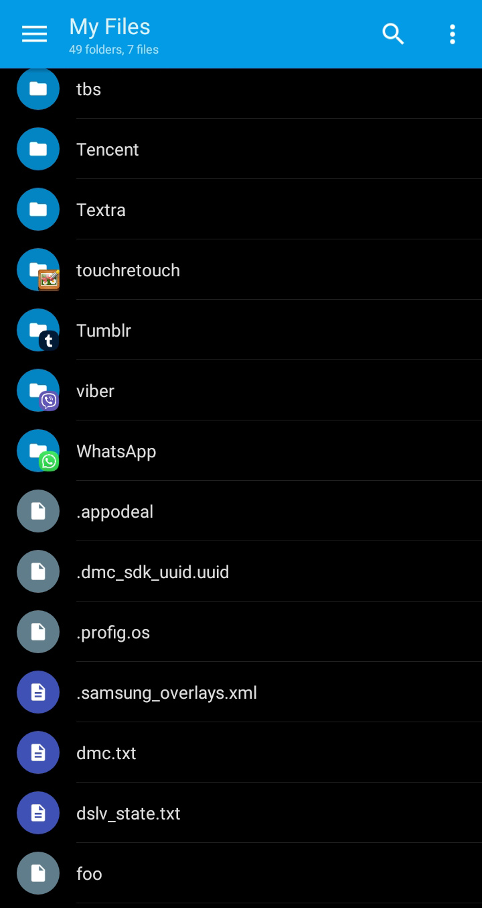
    </td>
    <td width="450" valign="top">
     While there are a number of newer and more hip file managers, Solid Explorer still takes the crown on features and customizeability. It has SFTP/Samba/Cloud/WebDav etc source options (with shortcuts), has root explorer, internal viewers, shortcuts and most probably all that you need.
    </td>
  </tr>
</table>

### [Textra SMS](https://play.google.com/store/apps/details?id=com.textra)

<table>
  <tr>
    <td>
      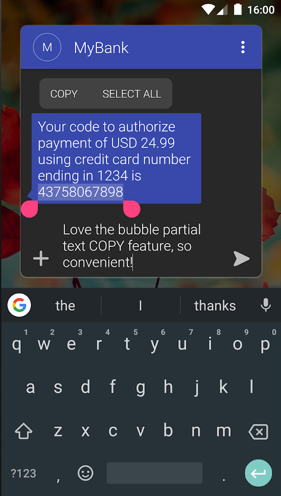
     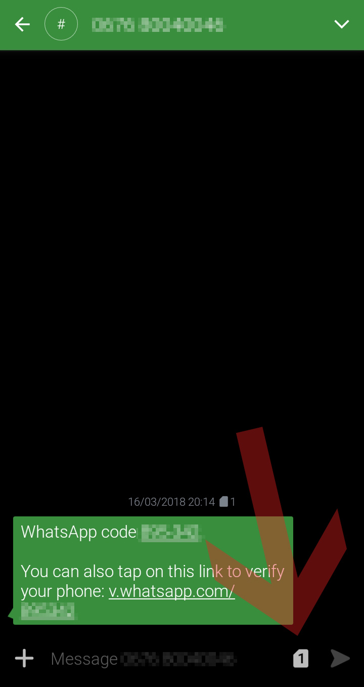
    </td>
    <td width="450" valign="top">
    There are many sms apps, but I thought this is the simplest, but still most versatile of them all. Slick, minimalistic design, a number of customization options and themes (including total black), excellent dual sim support and notification options.
  </tr>
</table>

### [AdAway](https://f-droid.org/packages/org.adaway/)

**Requires root** Removes ads through updated host files - not much to add, but its essential for a clean Android experience. Since its system-wide, it removes ads from within programs, browser windows, etc. Note that this app is obviously not supported by Google, therefore you need to download it from outside the Play Store.

# System settings

### Change the system dpi

<table>
  <tr>
    <td>
      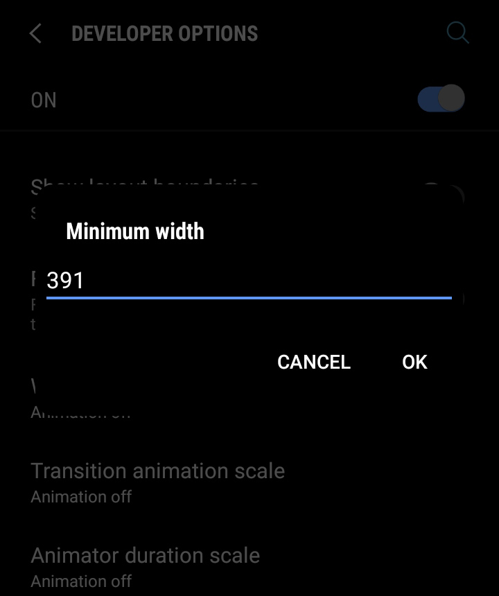
    </td>
    <td width="450" valign="top">
    This is not an app but a system setting, I still felt it's appropriate to include here. If you are not satisfied with how much screen space you have on your device, you can easily change the scale of the whole system. See more lines in your messaging app, more content in the browser, more space on the map at the cost of smaller UI elements. Enable the developer settings on your device.
  </tr>
</table>

### Remove all animations

If you want a more quicker-feeling phone, and don't need stupid transitions to rob your time (with hours of daily phone usage, even 300ms animations can add up) you can turn off all animations system-wide with a simple settings. Turn on the developer settings as written above.

# Photo editing

### [TouchRetouch](https://play.google.com/store/apps/details?id=com.advasoft.touchretouch)

<table>
  <tr>
    <td>
      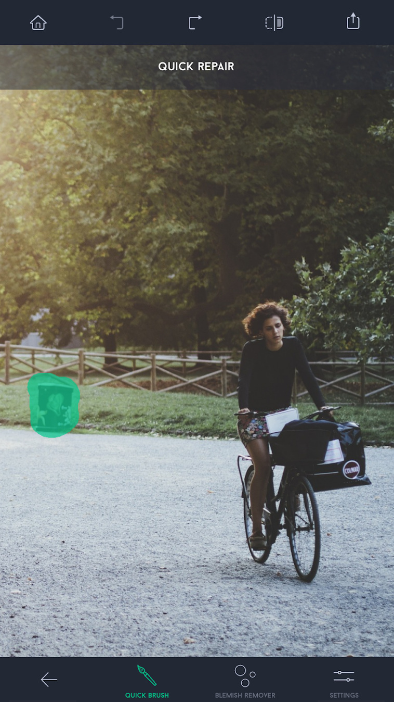
    </td>
    <td width="450" valign="top">
   You surely had the moment when you took the perfect picture, but there is a bird/person/smudge in it that distorts it. Enter TouchRetouch, which is a perfect mobile recreation of Photoshop's intelligent patch tool. You can select an area with a brush, and it will be autofilled based on the surroundings.
  </tr>
</table>

### [QuickPic](https://play.google.com/store/apps/details?id=com.alensw.PicFolder)

<table>
  <tr>
    <td>
      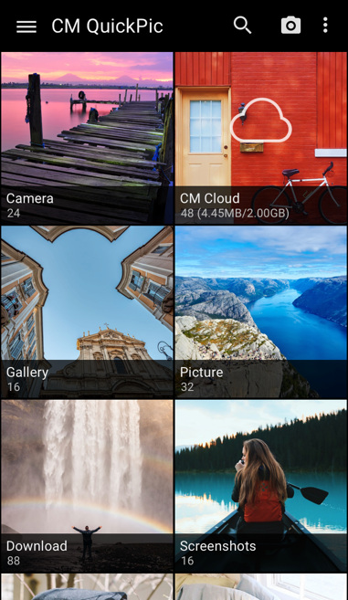
      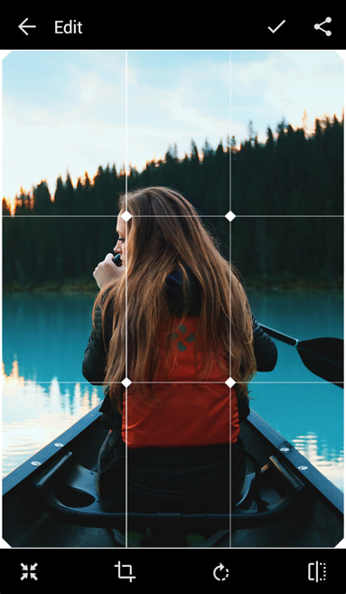
    </td>
    <td width="450" valign="top">
  The default gallery on most phones is filled with needless animations and bloat. While Quickpic also has some "advertised" features, but they can all be turned off. Besides being sleek and out of the way, you can also rotate pictures with a gesture, without modifying the files themselves.
  </tr>
</table>

### [Portfolio](https://play.google.com/store/apps/details?id=com.BrainyLantern.slingShotPortfolio)

<table>
  <tr>
    <td>
      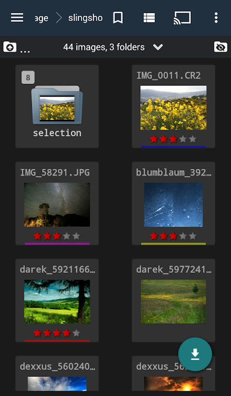
      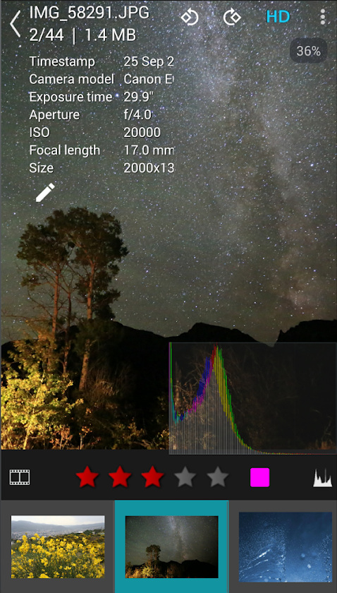
    </td>
    <td width="450" valign="top">
  A perfect RAW browser/converter. Load the contents of your camera sd card (either directly or through usb otg) and browse/convert them to jpg fast.
  </tr>
</table>

### [Slingshot](https://play.google.com/store/apps/details?id=com.BrainyLantern.slingShot)

<table>
  <tr>
    <td>
      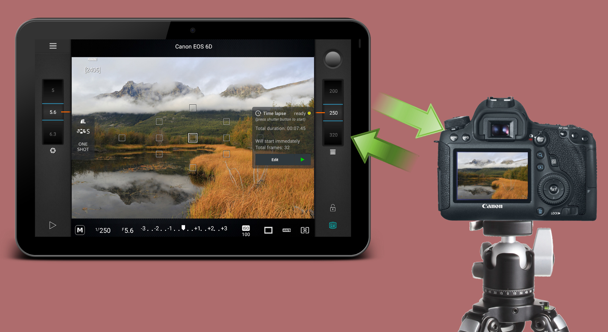
    </td>
    <td width="450" valign="top">
  Control any modern DSLR through Wi-Fi, including live preview and image copying. Great for any photographing work that needs remote control, like when you don't want any vibration by touching the shutter, or self portraits.
  </tr>
</table>

### [qDslrDashboard](https://play.google.com/store/apps/details?id=info.qdd)

<table>
  <tr>
    <td>
      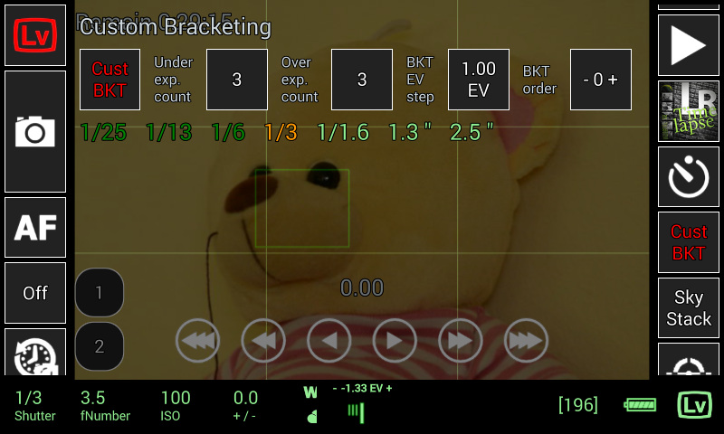
    </td>
    <td width="450" valign="top">
  Also an app to controll various DSLR-s through Wi-Fi, and although it sports a less friendly interface, it has a lot more options, including more robust picture control and camera image browser.
  </tr>
</table>
